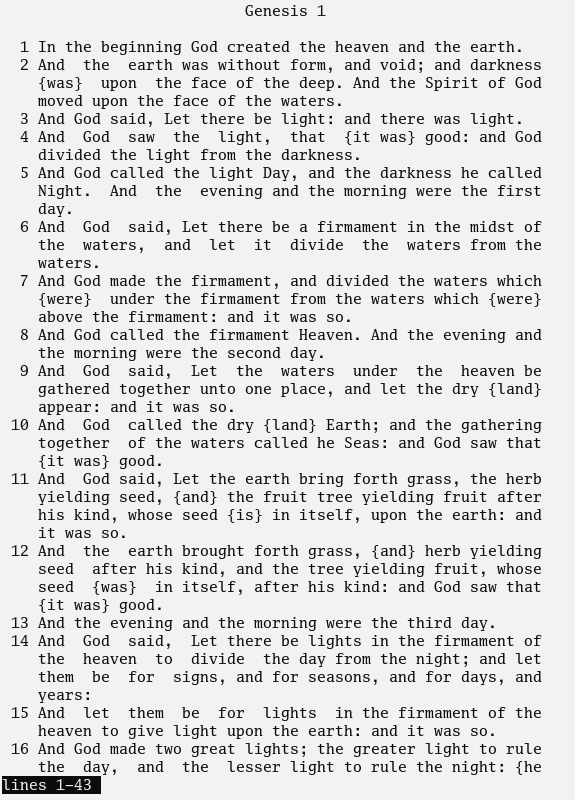

# The Bible

## Translations

- **SYN** — The Synodal Translation
- **KJV** — King James Version

## HTML

[https://red-magic.github.io/bible](https://red-magic.github.io/bible)


## TXT

Read TXT files directly in terminal using the `read-bible` Python script:

```
./read-bible txt/syn.txt | less -M
```



## Formatting Notes

> [!NOTE]
> - Words added for clarity are shown in `{braces}` in the TXT files and in *italics* in the HTML version.
> - In the Synodal Translation, text from the Septuagint is marked with `[brackets]`.
